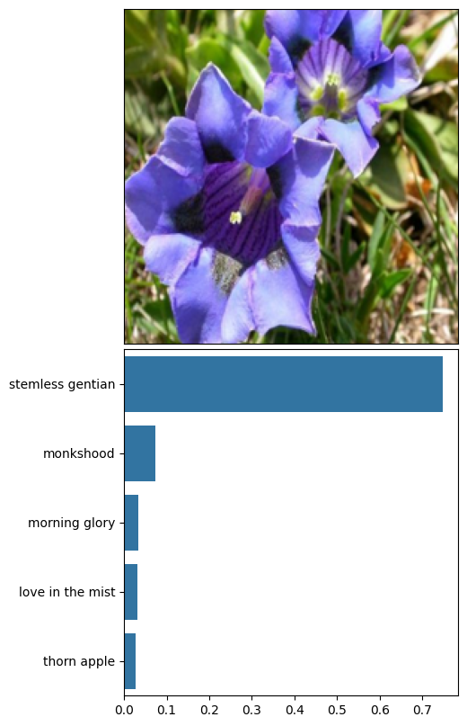

# Portfolio Overview

📊 data science 🧬 bioinformatics 🧮 algorithm development </> software development 📖 machine learning 🐍 Python

This page provides an overview of my public GitHub projects. For an overview of the projects that I have worked on professionally, please view my [LinkedIn profile](https://www.linkedin.com/in/matthew-perkett/). If you have an idea for a project, please reach out. I'd love to collaborate!

**Table of Contents**
- [Projects](#projects)
    - [Genome-kmers Python package](#genome-kmers-python-package)
    - [Audio Deconvolution Using Independent Component Analysis](#audio-deconvolution-using-independent-component-analysis)
- [Training](#training)
- [Training Projects](#training-projects)
    - [Donor Classification](#donor-classification)
    - [Customer Segment Analysis](#customer-segment-analysis)
    - [Flower Image Classification with TensorFlow](#flower-image-classification-with-tensorflow)
    - [Flower Image Classification with PyTorch](#flower-image-classification-with-pytorch)
    - [CIFAR-10 Image Classification with PyTorch](#cifar-10-image-classification-with-pytorch)

# Projects

## Genome-kmers Python package

> **Keywords**: bioinformatics | Python | numba | numpy. [Homepage](https://genome-kmers.readthedocs.io/en/latest/index.html) | [API](https://genome-kmers.readthedocs.io/en/latest/genome_kmers.html) | [Repo](https://github.com/mrperkett/genome-kmers)

This is an open-source bioinformatics project that implements fast and memory-efficient genome k-mer calculations.  It can be installed from PyPI with `pip install genome-kmers`.  A genome is often comprised of multiple chromosomes and the sequence of each chromosome can be represented as a long string of bases (`A`, `T`, `G`, or `C`).  A $k$-mer is a string of bases of length $k$.  Since a genome can be quite large (the human genome contains ~3e9 base pairs), it is necessary to select an efficient data structure so that memory usage does not become an issue.  I designed and implemented a data structure that scales with genome length, but not $k$.  It also uses `numba` to run orders of magnitude faster than pure Python.  Check out the [homepage](https://genome-kmers.readthedocs.io/en/latest/index.html#) for more information.

## Audio Deconvolution Using Independent Component Analysis

> **Keywords**: scikit-learn | signal processing [View Repo](https://github.com/mrperkett/ICA-audio-deconvolution)

This project demonstrates how to use Independent Component Analysis (ICA) to deconvolute mixed audio signals.  A classic application of ICA is to the *cocktail party problem* of trying to listen to a single person talking in a noisy room.  To mimic this situation, I programmatically mix audio recordings and then attempt to deconvolute the signal into separate recordings.  Since we have the original recordings, it is possible to quantify the level of success.

# Training

I decided to undertake a broad review of data science and machine learning to reinforce my knowledge of the fundamental statistics/algorithms and get experience with a broader range of tools and libraries. I have outlined the larger trainings that I am working through below.

Since I already have a foundation in machine learning, data science, and computer science fundamentals from my academic and professional background, I have used these trainings as a broad review to refresh my background, fill in gaps, and work on targeted projects.

- Book: [An Introduction to Statistical Learning](https://www.statlearning.com/) $\color{purple}{\textsf{In Progress}}$
    - Reading and working through exercises
- Online: [Introduction to Machine Learning with TensorFlow](https://www.udacity.com/course/intro-to-machine-learning-with-tensorflow-nanodegree--nd230) $\color{green}{\textsf{Complete}}$
- Online: [Introduction to Machine Learning with PyTorch](https://www.udacity.com/course/intro-to-machine-learning-nanodegree--nd229) $\color{green}{\textsf{Complete}}$
- Online: [AI Programming with Python](https://www.udacity.com/course/ai-programming-python-nanodegree--nd089) $\color{green}{\textsf{Complete}}$

# Training Projects

## Customer Segment Analysis

> **Keywords**: unsupervised learning | dimensional reduction | clustering | Docker. [View Repo](https://github.com/mrperkett/udacity-customer-segment-analysis)

This project identifies distinct demographics group German census data using PCA for dimensional reduction and K-Means clustering for group identification.  It then uses the demographics clusters to explore a company's customer base and identify potential opportunities (e.g. expanding user base, targeted marketing, etc).  Like any project using realistic data, this project devotes a significant portion of the analysis to data preprocessing.

## Donor Classification

> **Keywords**:  supervised learning | classification | random forest | SVM | Gaussian Naive Bayes | scikit-learn. [View Repo](https://github.com/mrperkett/udacity-donor-prediction)

This project builds a model to predict likely donors using basic demographic information (e.g. age, occupation, and education level).  Several supervised learning classifiers were tested before moving forward with the Random Forest classifier.  The best model was identified with hyperparameter tuning.  Testing for accuracy was done on withheld data (accuracy = 86%, $F_{0.5}$-score = 73%) and the most important features were identified.

## Flower Image Classification with TensorFlow

> **Keywords**: classification | TensorFlow | transfer learning | deep learning | Docker. [View Repo](https://github.com/mrperkett/udacity-flower-image-classifier-tensorflow)

This project uses transfer learning to build a model that classifies an input image of a flower into one of 102 different species.  The [MobileNetV3](https://arxiv.org/pdf/1905.02244) pretrained neural network is adapted to this task by freezing all layers except the final layer, which is replaced with a dense neural network for training.  The added layers are densely-connected with a relu activation function and dropout layers are added for regularization.  The final layer has softmax activation so that each flower type is predicted with probabilities that add to one.  During training, loss is calculated using sparse categorical cross entropy and accuracy is used as the metric.  An accuracy of 75% is achieved on the withheld test set.  A `Dockerfile` is provided to quickly get the notebook up and running.

## Flower Image Classification with PyTorch

> **Keywords**: classification | PyTorch | transfer learning | deep learning. [View Repo](https://github.com/mrperkett/udacity-flower-image-classifier-pytorch)

This project is very similar to [Flower Image Classification with TensorFlow](#flower-image-classification-with-tensorflow), but is implemented using PyTorch.

## CIFAR-10 Image Classification with PyTorch

> **Keywords**: classification | PyTorch | deep learning | Docker. [View Repo](https://github.com/mrperkett/udacity-image-classifier-cifar-10)

This project classifies images from the [CIFAR-10](https://www.cs.toronto.edu/~kriz/cifar.html) image data set into one of 10 categories (airplane, automobile, bird, etc).  To do this, a Convolutional Neural Network (CNN) is trained in PyTorch using accuracy as the metric.  Multiple NNs are tested (varying the number and size of layers) before selecting the best classifier, which has an accuracy of 70%.  The intent of this project is to work through all the necessary steps for training and validating a model rather.  To quickly build something with higher accuracy, we could consider using transfer learning using a pretrained neural network.  We would expect a good classifier to achieve and accuracy of >90% on this image set.

